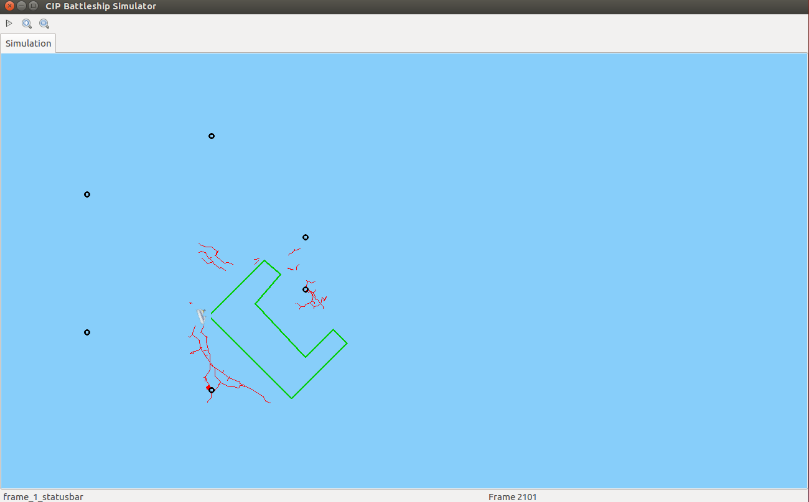
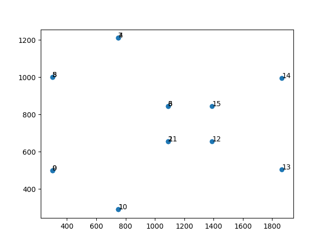
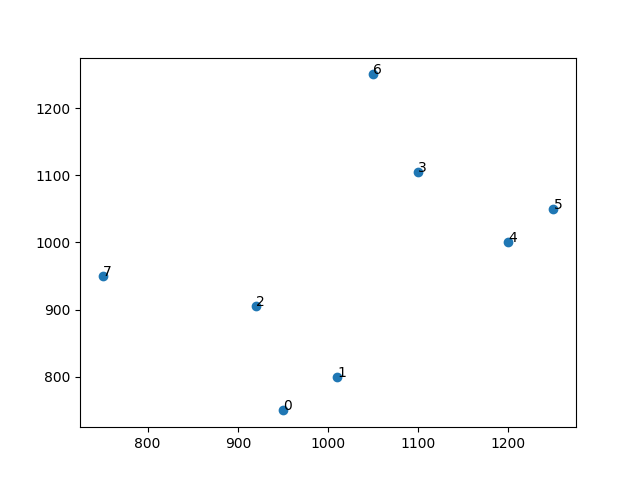

# CIP Navigation

## Dependencies

```
python 2.7
numpy 1.11.0
pygame 1.9.2
Pillow 4.0.0
pyparsing 1.5.7
pyserial 3.5
python-graph-core 1.8.2
python-graph-dot 1.8.2
scipy 0.17.0
tk 0.1.0
wxPython 3.0.2.0
wxPython-common 3.0.2.0
```

## Simulator

The ship navigation simulator

For `win` and `Linux` user with `x64` chip, please use `mainGUI.py.backup`

```bash
cd simulator

#CLI
python main.py -f <task file> -q

#GUI
python main.py -f <task file>
```

For `OS X` user with `M1` chip, please use `mainGUI.py` and `pythonw main.py -f <task file>`



## Tools

Tools help to design patrol points and obstacles.

Use `python 3` to run tools.

`python3 patrol-points.py`



`python3 obstacles.py`



